<div align="center">

### <code>manoj@github ~ $ ./contributions.sh</code>



<br><br>

### <code>manoj@github ~ $ whoami</code>

<table>
  <tr>
    <td valign="top"></td>
    <td valign="top"></td>
  </tr>
</table>

</div>

---

<details>
<summary>🛠️ How to customize & maintenance</summary>

### 1. Update Contribution Data locally
```bash
python scripts/fetch_contributions.py Manoj8763
python scripts/render_heatmap_svg.py
```

### 2. Customize Info Card
Edit `scripts/make_info_card.py` with your custom details, then run:
```bash
python scripts/make_info_card.py
```

### 3. Generate ASCII Portrait from new photo
```bash
python scripts/prep_photo.py <path-to-photo.jpg>
python scripts/make_ascii_svg.py
```

### 4. Enable GitHub Actions Daily Refresh
Push this repo to a public repository named `Manoj8763/Manoj8763` on GitHub. Ensure Actions permissions are set to **Read and write permissions** in `Settings > Actions > General`.
</details>
